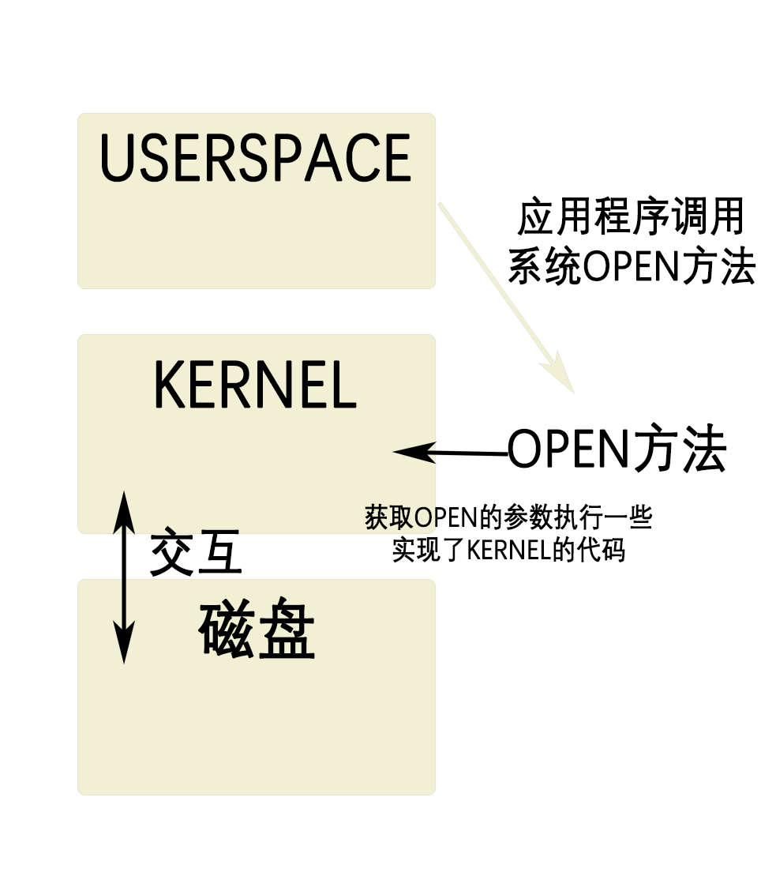

# 6.S081操作系统

视频课程的中文翻译：[简介 - MIT6.S081 (gitbook.io)](https://mit-public-courses-cn-translatio.gitbook.io/mit6-s081/)

视频课程：[6.S081 / Fall 2020 [麻省理工操作系统 - 2020 年秋季\][中英文字幕]_哔哩哔哩_bilibili](https://www.bilibili.com/video/BV19k4y1C7kA?spm_id_from=333.337.search-card.all.click&vd_source=54d88c3531bbb47aa4123072ef9c00aa)

# Lec01 Introduction And Examples

## 一、课程内容简介

接下来我想从列出这门课程的目标来开始。这门课程的目标有：

1. 

   理解操作系统的设计和实现。**1.设计是指整体的结构**，2.**实现是指具体的代码长什么样**。对于这两者，我们都会花费大量时间讲解。

2. 

   为了深入了解具体的工作原理，你们可以通过一个小的叫做**XV6的操作系统**，获得实际动手经验。通过研究现有的操作系统，并结合课程配套的实验，你可以获得**扩展操作系统**，修改并提升操作系统的相关经验，并且能够==**通过操作系统接口，编写系统软件。**==

所以，这些就是你将要在课程中完成的内容。

我们同时也对操作系统本身的目标感兴趣。对于操作系统的目标，我也列出了几个点。你知道的，市面上有**大量不同的操作系统**，通常来说，他们都有一些共同的目标。

### 1.Abstraction抽象

**第一个就是抽象硬件**。通常来说，你会买一个计算机，里面包含了**CPU，内存**，但是这是一种**非常低层级的资源**。幸好我们有**一些应用程序实现了高层级的接口和抽象**，例如==进程，文件系统。这些高层级的接口和抽象（Abstraction）方便了应用的开发，也提供了更好的移植性。==

### 2.multiplex多复用性

操作系统的另一个重要的任务是：**在多个应用程序之间共用硬件资源**。你可以在一个操作系统同时运行**文本编辑器，程序编译器，多个数据库**等等。==操作系统能非常神奇的在不相互干扰的前提下，同时运行这些程序。这里通常被称为multiplex（多复用的）。==

### 3.isolation隔离性

因为在操作系统中可能同时运行很多程序，即使程序出现了故障，**多个程序之间互不干扰就变得非常重要**。所以这里需要**隔离性（Isolation）**，不同的活动之间不能相互干扰。

### 4.sharing共享

但是另一方便，不同的活动之间**有时又想要相互影响**，比如说**数据交互，协同完成任务**等。举个例子，我通过文本编辑器创建了一个文件，并且我希望我的编译器能读取文件，我绝对想要数据能共享。所以，我们希望能在需要的时候实现共享（Sharing）。

### 5.Security安全

但是在很多场景下，用户并不想要共享，比如你登录到了**一个公共的计算机**，例如Athena，你不会想要其他人来读取你的文件。所以在共享的同时，**我们也希望在没有必要的时候不共享**。这里我们称为**Security或者Permission System或者是Access Control System。**

### 6.performance高性能

另一个人们认为操作系统应该具有的价值是：如果你在硬件上花费了大量的金钱，你会期望你的应用程序拥有硬件应该提供的完整性能，但是很多时候你只负责应用程序编程，你会期望操作系统**也必须保证自身提供的服务不会阻止应用程序获得高性能**。所以==操作系统需要至少不阻止应用程序获得高性能，甚至需要帮助应用程序获得高性能（Performance）。==

### 7.Range of oses（操作系统范围）

最后，对于大部分操作系统，必须要支持大量不同类型的应用程序，或许这是一个笔记本，正在运行文本编辑器，正在运行游戏，或许你的操作系统需要支持数据库服务器和云计算。通常来说，**设计并构造一个操作系统代价是非常大的**，所以人们总是希望在相同的操作系统上，例如Linux，**运行大量的任务**。我认为大部分人都已经跑过**Linux**，并使用了我刚刚描述的所有的场景。所以，**同一个操作系统需要能够支持大量不同的用户场景**。

我们期望操作系统能够同时支持上面所有的目标。我们在这门课程中，会介绍更多有关这些目标的内容。

## 二、 操作系统结构

过去几十年，人们将一些**分层的设计思想**加入到操作系统中，并运行的很好。我将会为你列出操作系统经典的组织结构，这个组织结构同时也是这门课程的主要内容，**这里的组织结构对于操作系统来说还是挺常见的**。

有三层：1.硬件底层、2.kernel、3.userspace

### 1、硬件底层

这里实际上就是操作系统内部组成，当我想到这里的组织结构时，我首先会想到用一个矩形表示一个计算机，这个计算机有一些硬件资源，我会将它放在矩形的下面，硬件资源包括了**CPU，内存，磁盘，网卡。**所以硬件资源在最低一层。

### 2、userspame

在这个架构的==最上层==，我们会运行各种各样的==应用程序==，**或许有一个文本编辑器（VI）**，或许有一个C编译器（CC），你还可以运行大量我们今天会讨论的其他事物，例如作为CLI存在的Shell，所以这些就是正在运行的所有程序。这里程序都运行在同一个空间中，**这个空间通常会被称为用户空间（Userspace）**。

### 3、kernel

区别于用户空间程序，有一个特殊的程序总是会在运行，它称为**Kernel**。Kernel是==计算机资源的守护者==。当你打开计算机时，**Kernel总是第一个被启动**。Kernel程序只有一个，**它维护数据来管理每一个用户空间进程**。

#### 3.1、kernel内存管理

==Kernel同时还维护了大量的数据结构来帮助它管理各种各样的硬件资源，以供用户空间的程序使用。==

Kernel同时还有大量内置的服务，例如，**Kernel通常会有文件系统实现类似文件名，文件内容，目录的东西，并理解如何将文件存储在磁盘中。所以用户空间的程序会与Kernel中的文件系统交互，文件系统再与磁盘交互。**

在这门课程中，我们==主要关注点在Kernel==、**连接Kernal和用户空间程序的接口、Kernel内软件的架构**。所以，我们会关心Kernel中的服务，其中一个服务是文件系统，另一个就是进程管理系统。每一个用户空间程序都被称为一个**进程**，它们有自己的**内存和共享的CPU时间**。同时，**Kernel会管理内存的分配。不同的进程需要不同数量的内存，Kernel会复用内存、划分内存，并为所有的进程分配内存。**

#### 3.2、kernel中文件系统。

文件系统通常有一些**逻辑分区**。目前而言，我们可以认为**文件系统的作用是==管理文件内容==并==找出文件具体在磁盘中的哪个位置==**。文件系统还维护了一个独立的命名空间，其中每个文件都有**文件名**，并且命名空间中有一个层级的目录，**每个目录包含了一些文件**。所有这些都被==文件系统所管理==。

**理解：文件在磁盘中是分散的,而操作系统的kernel就是了解把这些发散在磁盘的文件，通过本身文件信息，形成一个有文件名，文件内容，文件目录的文件系统。**

#### 3.3、kernel的安全规则access规则

这里还有一些安全的考虑，我们可以称之为Access Control。当一个进程想要使用某些资源时，比如读取磁盘中的数据，使用某些内存，Kernel中的Access Control机制会决定是否允许这样的操作。对于一个分时共享的计算机，例如Athena系统，这里可能会变得很复杂。因为在Athena系统中，**每一个进程可能属于不同的用户，因此会有不同Access规则来约定哪些资源可以被访问。**

在一个真实的完备的操作系统中，会有很多很多其他的服务，比如在不同进程之间通信的进程间通信服务，比如一大票与网络关联的软件（TCP/IP协议栈），比如支持声卡的软件，比如支持数百种不同磁盘，不同网卡的驱动。所以在一个完备的系统中，Kernel会包含大量的内容，数百万行代码。

这就是对于Kernel的一个快速浏览。

#### 3.4、kernel总结

总结：kernel是一个在用户程序和计算机硬件之间的特殊程序，他的作用是1.交互userspace和硬件，2.分配内存与cup时间给userspace中的应用程序，3.存在文件系统管理磁盘中的文件，并合理分级。4.有access安全规则，保护文件在同一计算机的不同用户。

我们同时也对应用程序是如何与Kernel交互，它们之间的接口长什么样感兴趣。这里通常成为Kernel的API，它决定了应用程序如何访问Kernel。通常来说，这里是通过所谓的系统调用（System Call）来完成。系统调用与程序中的函数调用看起来是一样的，但区别是系统调用会实际运行到系统内核中，并执行内核中对于系统调用的实现。在这门课程的后面，我会详细介绍系统调用。现在，我只会介绍一些系统调用在应用程序中是长什么样的。

三、

第一个例子是，如果应用程序需要打开一个文件，它会调用名为**open的系统调用**，并且把文件名作为参数传给open。假设现在要打开一个名为“out”的文件，那么会将文件名“out”作为参数传入。同时我们还希望写入数据，那么还会有一个额外的参数，在这里这个参数的值是1，表明我想要写文件。

这里看起来像是个函数调用，但是**open是一个系统调用**，它会跳到Kernel，Kernel可以获取到open的参数，执行一些实现了open的Kernel代码，或许会与磁盘有一些交互，最后返回一个文件描述符对象。上图中的fd全称就是file descriptor。之后，应用程序可以使用这个文件描述符作为handle，来表示相应打开的文件。

如果你想要向文件写入数据，相应的系统调用是write。你需要向write**传递一个由open返回的文件描述符作为参数**。你还需要向write传递一个指向要写入数据的指针（数据通常是char型序列），在C语言中，可以简单传递一个双引号表示的字符串（下图中的\n表示是换行）。第三个参数是你想要写入字符的数量。

在写文件内容的时候要先调用系统函数open打开文件。

第二个参数的指针，实际上是内存中的地址。所以这里实际上告诉内核，将内存中这个地址起始的**6个字节数据写入到fd对应的文件中**。

另一个你可能会用到的，**更有意思的系统调用是fork**。fork是一个这样的系统调用，它创建了一个与==调用进程一模一样的新的进程==，并返回**新进程的process ID/pid**。这里实际上会复杂的多，我们后面会有更多的介绍。

所以对吧？**这些系统调用看起来就跟普通的函数调用一样。系统调用不同的地方是，它最终会跳到系统内核中。**

这里只是浅尝辄止，我们后面会介绍更多。所以这些是一些快速预览。

#### 3.5大概了解一下应用程序调用系统函数时，操作系统结构的动作

##三、 Why Hard and Interesting

我还想说一下为什么我认为学习操作系统是挑战和乐趣并存的？以及为什么我需要专门去学操作系统？

学习操作系统比较难的一个原因是，**内核的编程环境比较困难**。当你在==编写、修改，扩展内核，或者写一个新的操作系统内核时，你实际上在提供一个基础设施让别人来运行他们的程序==。当程序员在写普通的应用程序时，应用程序下面都是操作系统。而当我们在构建操作系统时，在操作系统下面就是硬件了，这些硬件通常会更难处理。在这门课程中，我们会使用一个叫做**QEMU的硬件模拟器**，来模拟CPU和计算机。这会简单一些，但即使这样，编程环境还是比较恶劣。

学习操作系统比较难的另一个原因是，当你在设计一个操作系统时，你需要满足一些列矛盾的需求。

### 1、Hard：

#### 1.1、efficient—abstract（高效率与抽象）

- 要符合高性能**硬件**又要高效接口给**应用程序**

  其中一个是，你想要你的操作系统既高效又易用。高效通常意味着操作系统需要在离硬件近的low-level进行操作，而易用则要求操作系统为应用程序提供抽象的high-level可移植接口。所以，提供一个简单可移植，同时又高效的抽象接口需要一定的技巧。

#### 1.2、powerful—simple（强大与简单）

- 提供一个简单但是又强大的**API接口**

  另一个矛盾的点是，我们想要提供一个非常强大的操作系统服务，这样操作系统才能分担运行应用程序的负担，所以我们需要强大的操作系统服务。但同时，我们也想要有简单的接口。我们不想程序员看到数量巨多，复杂且难以理解的的内核接口。因为，如果他们不理解这些接口，他们就会很难使用这些接口。所以，**我们也想要简单的API**。实际上是有可能提供既简单，同时又包含强大功能的接口。所以，这里要提供一个简单的接口，同时又包含了强大的功能。

> 学生提问：系统调用跳到内核与标准的函数调用跳到另一个函数相比，区别是什么？
>
> Robert教授：Kernel的代码总是有特殊的权限。当机器启动Kernel时，Kernel会有特殊的权限能直接访问各种各样的硬件，例如磁盘。而普通的用户程序是没有办法直接访问这些硬件的。所以，当你执行一个普通的函数调用时，你所调用的函数并没有对于硬件的特殊权限。然而，如果你触发系统调用到内核中，内核中的具体实现会具有这些特殊的权限，这样就能修改敏感的和被保护的硬件资源，比如访问硬件磁盘。我们之后会介绍更多有关的细节。

#### 1.3、flexible—secure（灵活性和安全性）

- 与应用程序最好的灵活性但是又要有安全性

  **最后一个矛盾点是所有的操作系统需要满足的**。你希望给与应用程序尽可能多的**灵活性**，你不会想要限制应用程序，所以你需要内核具备灵活的接口。但是另一方面，你的确需要在某种程度上限制应用程序，因为你会想要**安全性**。我们希望给程序员完全的自由，但是实际上又不能是真正的完全自由，因为我们不想要程序员能直接访问到硬件，干扰到其他的应用程序，或者干扰操作系统的行为。

设计一个好的操作系统还是有可能的，我们后面会大量讨论这个话题。但是想要同时提供上图中两列里面的属性，还是有点难的。

### 2、Interesting

#### 2.1、操作系统有大量服务，服务之间存在交互

另一件使得操作系统的设计难且**有趣的点**是：操作系统提供了**大量的特性和大量的服务，但是它们趋向于相互交互**。有时，这种交互以奇怪的方式进行，并且需要你大量的思考。即使在我之前给出的一个简单例子中，对于open和fork，它们之间也可能有交互。如果一个应用程序通过open系统调用得到了一个文件描述符fd。之后这个应用程序调用了fork系统调用。fork的语义是创建一个当前进程的拷贝进程。而对于一个真正的拷贝进程，**父进程中的文件描述符也必须存在且可用**。所以在这里，一个通过open获得的文件描述符，与fork以这种有趣的方式进行交互。当然，你需要想明白，子进程是否能够访问到在fork之前创建的文件描述符fd。在我们要研究的操作系统中答案是，**Yes，需要能够访问**。

#### 2.2、需要能够满足广泛的试用场景

另一件有趣的事情，我之前也提到过，**操作系统需要能够满足广泛的使用场景**。相同的操作系统需要既给数据库服务器使用，又给智能手机使用。随着时间的推移，你的计算机所使用的硬件也在变化，或许你有了超级快的SSD存储而不是机械的硬盘。大概15年前，多核CPU计算机还极其稀有，而现在变得极其的流行。最近，我们又看到了网速以指数级增长。所有的这些都需要时不时的重新思考，操作系统是如何被设计的。

前面理性的分析了一下为什么你要学习这门课程。同时，这里也有一些更加实际的原因来告诉你**为什么会选择这门课程**。

- 计算机运行原理

  其中一个原因是，如果你对于**计算机的运行原理感兴趣**，对于你打开计算机以后实际发生的事情感兴趣，那么这门课程你就选对了。

- 基础架构

  类似的，如果你**喜欢基础架构**，比如你喜欢构建一些其他程序可以使用的服务，那么这门课程都是有关基础架构的内容，因为**操作系统就是基础架构。**

- 解决应用程序的很多问题

  如果你曾经**花费了大量的时间来定位应用程序的Bug**，或者**定位安全的问题**，那么你会发现这些经历**通常需要理解操作系统是如何运作**的。比如从根本上来说，==操作系统涉及了很多安全相关的策略。当程序运行出错时，操作系统需要来收拾残局，而这一步也通常包括在定位问题中==。

> 学生提问：对于应用程序开发人员来说，他们会基于一些操作系统做开发，真正的深入理解这些操作系统有多重要？他们需要成为操作系统的专家吗？
>
> Robert教授：你不必成为一个专家。但是如果你花费大量时间来开发，维护并调试应用程序，你最终还是会知道大量操作系统的知识。不论你是否是有意要掌握这些知识，它们就是出现了，而你不得不去理解它们。
>
> 学生提问：对于一些例如Python的高阶编程语言（高阶是指离自然语言更接近，低阶是指离机器语言更接近如C，汇编），它们是直接执行系统调用呢，还是内部对系统调用进行了封装呢？
>
> Robert教授：许多高阶的编程语言都离系统调用较远，这是一个事实。部分原因是很多编程语言想要提供可以在多个操作系统上运行的可移植的环境，所以它们不能依赖特定的系统调用。所以，对于这个问题的答案我认为是，如果你使用了Python，你在某种程度上就与系统调用接口隔离了。当然，在Python内部，最终还是要执行系统调用来完成相应的工作。当然，Python和许多其他的编程语言通常都有方法能直接访问系统调用。

## 四、 课程结构和资源

我们会讲解**操作系统的基本概念**。有几节课会专注于学习XV6中的代码，XV6是我们的一个**小的用于教学的操作系统**，我们会介绍它是如何工作，查看它的代码，并在课程中演示代码的运行。

要求你们阅读介绍XV6的书籍，书籍的内容是XV6如何运行以及设计思想。所以你应该在课程之前完成相应的阅读，这样你才能理解课程的讨论内容。有几节课会专注于帮助你完成实验内容，例如解释C语言是如何工作的，例如介绍RISC-V是如何工作的，这是我们将要使用的一个微处理器。这些内容对于你们完成实验是有帮助的。在课程的结束部分，我们会花几节课时间来阅读**一些操作系统相关的论文**，包括一些研究论文和一些经典论文。我们会要求你在课程之前阅读这些论文，我们也会在课堂上讨论这些论文。几乎对于所有的课，我们会要求你对于阅读材料提出一些问题，我们会读取这些问题，以帮助我们决定课程上讲解什么内容，并且我们也会尽可能的回答这些问题。

这门课程的下一大部分是**lab**，几乎每周都会有一些编程实验。实验的意义在于帮助你**获得一些使用和实现操作系统的实际动手经验**。比如说，下周截止的实验实际上是写一些应用程序代码来执行我们之前谈到的系统调用，之后的大部分实验则要求你要么实现基本的操作系统功能或者扩展XV6操作系统。最后一个lab会要求你添加==一个网络协议栈和一个网络驱动==，这样操作系统才能连接到网络上。如果你对于实验有问题，你可以在Piazza提出问题，助教会在办公时间解答。我们鼓励你们去讨论实验相关的内容，讨论如何完成实验，但是请不要抄别人的答案。lab中所有的代码都必须是你自己写的，你不应该分享代码或者查看别人的代码

你可以看出，这是一门注重软件实操经验的课程。

> 学生提问：lab是只有对或者错两种结果吗？有中间结果吗？
>
> Robert教授：嗯。。。这个我还没考虑过。会有中间结果的。

## 五、 read, write, exit系统调用

接下来，我将讨论对于应用程序来说，系统调用长成什么样。因为系统调用是操作**系统提供的服务的接口**，所以系统调用长什么样，**应用程序期望从系统调用得到什么返回，系统调用是怎么工作的**，这些还是挺重要的。你会在第一个lab中使用我们在这里介绍的系统调用，并且在后续的lab中，扩展并提升这些系统调用的内部实现。

我接下来会展示一些简单的例子，这些例子中会执行系统调用，并且我会在XV6中运行这些例子。**XV6是一个简化的类似Unix的操作系统**，而Unix是一个老的操作系统，但是同时也是很多现代操作系统的基础，例如**Linux，OSX。所以Unix使用的非常广泛。而作为我们教学用的操作系统，XV6就要简单的多。它是受Unix启发创造的，有着相同的文件结构，但是却要比任何真实的Unix操作系统都要简单的多**。因为它足够简单，所以你们极有可能在几周内很直观的读完所有的代码，同时也把相应的书也看完，这样你们就能理解XV6内部发生的一切事情了。

**XV6运行在一个RISC-V微处理器上**，而RISC-V是MIT6.004课程讲解的处理器，所以你们很多人可能已经知道了**RISC-V指令集**。理论上，你可以在一个RISC-V计算机上运行XV6，已经有人这么做了。**但是我们会在一个QEMU模拟器上运行XV6。**

==Xv6是由[麻省理工学院](https://baike.baidu.com/item/麻省理工学院/117999?fromModule=lemma_inlink)(MIT)为操作系统工程的课程（代号6.828）,开发的一个教学目的的操作系统。Xv6是在x86处理器上(x即指x86)用[ANSI标准](https://baike.baidu.com/item/ANSI标准/3127116?fromModule=lemma_inlink)C重新实现的Unix第六版(Unix V6，通常直接被称为V6)。==

==**RISC-V**（发音为“risk-five”）是一个基于[精简指令集](https://baike.baidu.com/item/精简指令集?fromModule=lemma_inlink)（RISC）原则的[开源](https://baike.baidu.com/item/开源?fromModule=lemma_inlink)[指令集架构](https://baike.baidu.com/item/指令集架构?fromModule=lemma_inlink)（ISA）。==

==QEMU是模拟器，模拟我们的电脑硬件，有较高的速度。==

我这里会写下来，我们的操作系统是XV6，它运行在RISC-V微处理器上，当然不只是RISC-V微处理器，我们假设有一定数量的其他硬件存在，例如内存，磁盘和一个**console接口**，这样我们才能跟操作系统进行交互。但是实际上，**XV6运行在QEMU模拟器之上。这样你们都能在没有特定硬件的前提下，运行XV6。**

首先设置好XV6。首先输入make qemu，实验中会经常用到这个命令。这个命令会编译XV6，而XV6是用C语言写的。先执行一下make clean，这样就能看到完整的编译过程。

之后我输入make qemu，这条指令会编译并构建xv6内核和所有的用户进程，并将它们运行在QEMU模拟器下。

编译需要花费一定的时间。

现在xv6系统已经起来并运行了。**$表示Shell**，这是参照Unix上Shell的命令行接口。如果你用过Athena工作站，它的Shell与这里的非常像。XV6本身很小，并且自带了一小部分的工具程序，例如ls。我这里运行ls，它会输出xv6中的所有文件，这里只有20多个。

可以看到，这里还有grep，kill，mkdir和rm，或许你们对这些程序很熟悉，因为它们在Unix中也存在。

我向你们展示的第一个系统调用是一个叫做copy的程序。

它的源代码只有不到一页。你们这里看到的是一个程序，它从第8行的main开始，这是C程序的风格。它在第12行进入到一个循环中，在循环中，它会在第13行从输入读取一些数据，并在第16行，将数据写入到输出。如果我在XV6中运行这个copy程序，

它会等待输入。我随便输入一些字符，程序会读取我输入的字符，并将相同的字符输出给我。

所以这是一个非常简单的程序。如你所看到的，这个程序是用C语言写的，如果你不懂C语言，那最好还是去读一本标准的[C编程语言](https://zh.wikipedia.org/wiki/C程序设计语言_(书))。这个程序里面执行了3个系统调用，分别是read，write和exit。

如果你看第13行的read，它接收3个参数：

- 文件描述符(0/1)

  第一个参数是文件描述符，指向一个之前打开的文件。Shell会确保默认情况下，当一个程序启动时，文件描述符0连接到console的输入，文件描述符1连接到了console的输出。所以我可以通过这个程序看到console打印我的输入。当然，这里的程序会预期文件描述符已经被Shell打开并设置好。这里的0，1文件描述符是非常普遍的Unix风格，许多的Unix系统都会从文件描述符0读取数据，然后向文件描述符1写入数据。

- 指针

  read的第二个参数是指向某段内存的指针，程序可以通过指针对应的地址读取内存中的数据，这里的指针就是代码中的buf参数。在代码第10行，**程序在栈里面申请了64字节的内存，并将指针保存在buf中，这样read可以将数据保存在这64字节中**。

- 存取的数据长度

  read的第三个参数是代码想读取的最大长度，==sizeof(buf)表示，最多读取64字节的数据==，所以这里的read最多只能从连接到文件描述符0的设备，也就是console中，读取64字节的数据。

read的返回值可能是读到的字节数，在上面的截图中也就是6（xyzzy加上结束符）。read可能从一个文件读数据，如果到达了文件的结尾没有更多的内容了，read会返回0。如果出现了一些错误，比如文件描述符不存在，read或许会返回-1。在后面的很多例子中，比如第16行，我都没有通过检查系统调用的返回来判断系统调用是否出错，但是你应该比我更加小心，**应该清楚系统调用通常是通过返回-1来表示错误，你应该检查所有系统调用的返回值以确保没有错误。**

如果你想知道所有的系统调用的参数和返回值是什么，在XV6书籍的第二章有一个表格。

> 学生提问：如果read的第三个参数设置成1 + sizeof(buf)会怎样？
>
> Robert教授：如果第三个参数是65字节，操作系统会拷贝65个字节到你提供的内存中（第二个参数）。但是如果栈中的第65个字节有一些其他数据，那么这些数据会被覆盖，这里是个bug，或许会导致你的代码崩溃，或者一些异常的行为。所以，作为一个程序员，你必须要小心。C语言很容易写出一些编译器能通过的，但是最后运行时出错的代码。虽然很糟糕，但是现实就是这样。

有一件事情需要注意的事，这里的copy程序，或者说read，write系统调用，它们并不关心读写的数据格式，它们就是单纯的读写，而copy程序会按照8bit的字节流处理数据，你怎么解析它们，完全是用应用程序决定的。所以应用程序可能会解析这里的数据为C语言程序，但是操作系统只会认为这里的数据是按照8bit的字节流。

open系统调用

copy代码假设文件描述符已经设置好了。但是一般情况下，我们需要能创建文件描述符，最直接的创建文件描述符的方法是open系统调用

