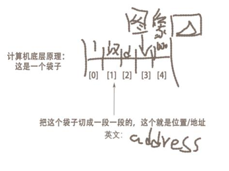
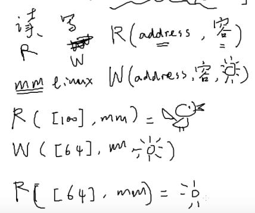
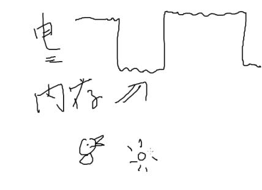
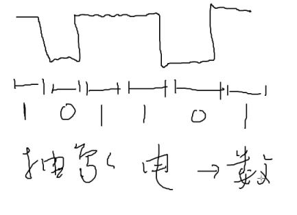
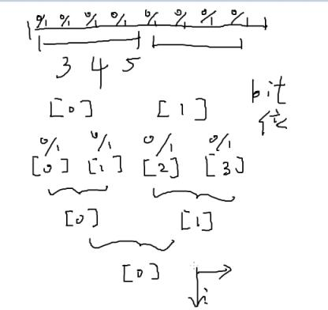
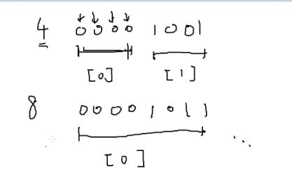
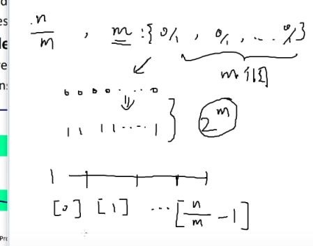
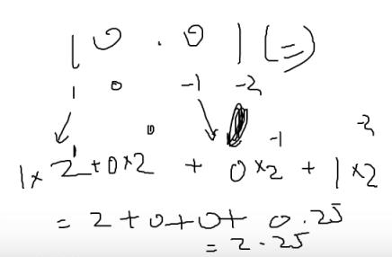
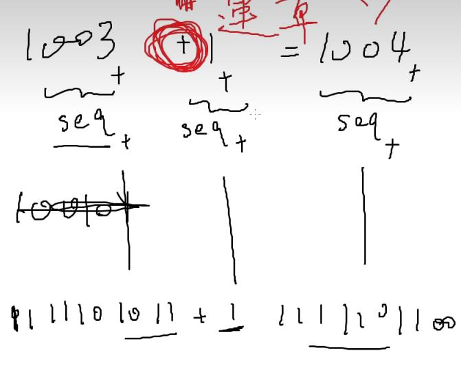
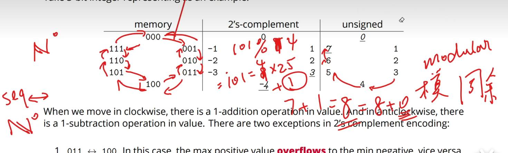

【yaaangmin的个人空间-哔哩哔哩】 https://b23.tv/zEW87F7

讲的太全，有时候我也觉得有点长，但肚子里是真的有料，技术肯定是叼的

MESI协议他讲的很好

很适合多线程入门

# 深入理解计算机系统：

## 大概的底层思想：

计算机的底层就是：

存：比如说，一个鱼图片存在3地址，一个虎图像存在5地址

读read，写write。

计算机是一一映射的

计算机系统简单理解就是做这么一个事情，读写一一映射

电脑就是一个电，电就是电流，内存就是用来存这个电压。

电压有高有低。

计算机就只能读懂010，高低电压。

计算机就是把电转换为数字。

很多大佬都在做一个事情：

有些电脑的内存中的0/1特别的多

大佬就会把相邻的0/1，2个或者更多合并为一个0/1,去减少内存中的0/1

比如4、8个bit分一块。

**但是这样会有一个限制。**

假设我们的内存有bit内存。我们把m个bit变成一个块。

总共的块数量就是m/n  大小就是m

但是这样就出现一个问题。

知道什么是排列组合吗？

m大小中的0和1的排列组合是2的m次幂

为了我们要块能成立，不多出一个或者多个没有被块包括的地址

就要成立n/m>=2的次幂

注意分块。

## 十进制与二进制：

二进制转十进制--》10.01  = 1\*2^1+0\*2^0 . 0\*2^-1+1*2^-2 = 2.25

可以发现二进制与十进制的加1减1都是一一对应的关系。

都对应一个无符号整数（这个是抽象的）

## 符号序列：

